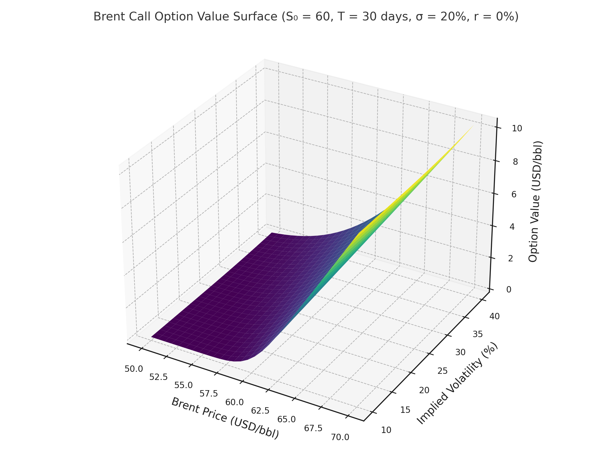

**Abstract.** Delta hedging is the default response to spot risk in commodity options, yet the approach leaves portfolios exposed to volatility repricing, convexity drift and time decay. This paper applies the Black–Scholes framework to an at-the-money Brent call to quantify how Delta, Gamma, Vega and Theta interact once the primary hedge is in place. We first derive the per-contract Greeks and validate them through scenario-based Taylor decompositions of price, volatility and time shocks. We then scale these sensitivities to a 100,000-bbl physical short and design a practical mix of physical, futures and 30d/60d options that keeps Delta and Vega near zero while accepting a manageable Theta carry. Stress tests highlight how small futures adjustments and occasional option rolls maintain balance when spot rallies 8% or implied volatility rises by five points. The resulting hedge playbook offers a market-ready template for energy desks: keep analytical Greeks in physical units, rebalance Delta/Vega frequently, and treat Theta as an intentional cost that buys resilience during volatility spikes.

## 1. Overview

Delta hedging is the market standard for controlling spot exposure in commodity options, yet it neutralises only the first-order price term. Implied-volatility repricing, convexity and calendar decay can dominate P&L, especially in short-dated energy optionality. This note applies the Black–Scholes model to an at-the-money Brent call and quantifies how much risk survives after flattening Delta. The rest of the document walks from analytical expressions to actionable hedge sizing and demonstrates a delta–vega–theta balanced book under realistic stress tests.

## 2. Methodology

### 2.1 Analytical framework

Black–Scholes provides a closed-form link between spot, volatility, time and option value. For a European call, the valuation is

$$
V = S N(d_1) - K e^{-rT} N(d_2),
$$

where

$$
d_1 = \frac{\ln(S/K) + (r + 0.5\sigma^2)T}{\sigma \sqrt{T}}, \qquad
d_2 = d_1 - \sigma \sqrt{T}.
$$

### 2.2 Economic meaning of the Greeks

Differentiating the pricing function isolates the sensitivities that matter on a trading desk:

$$
\Delta = N(d_1), \qquad
\Gamma = \frac{N'(d_1)}{S\sigma\sqrt{T}}, \qquad
\text{Vega} = S N'(d_1)\sqrt{T}, \qquad
\Theta = -\frac{S N'(d_1)\sigma}{2\sqrt{T}} - r K e^{-rT} N(d_2).
$$

- Delta: captures the linear response to spot moves and is the quantity neutralised by a delta hedge.
- Gamma: measures convexity and determines how fast Delta itself changes.
- Vega: quantifies the mark-to-market impact of implied-volatility shocks, independent of spot.
- Theta: measures calendar decay, the predictable erosion in option value as expiry approaches.

### 2.3 Base calibration

| Parameter | Symbol | Value | Description |
|------------|---------|--------|-------------|
| Spot price | $S_0$ | USD 60/bbl | Brent front-month futures |
| Strike price | K | USD 60/bbl | At the money |
| Time to maturity | T | 30 days | 30/365 year (~0.082) |
| Implied volatility | $\sigma$ | 20% | Annualised |
| Risk-free rate | r | 0% | Simplified assumption |

Under this calibration, the call is worth $V_0 \approx 1{,}372.29$ USD per 1,000-bbl contract. The corresponding Greeks are:

| Parameter | Symbol | Per contract (1,000 bbl) | Portfolio (100 contracts) |
|------------|---------|------------------------:|--------------------------:|
| Delta | Δ | +511.4 | +51,144 |
| Vega | per vol point | +68.60 | +6,860 |
| Theta | Θ USD/day | −22.87 | −2,287 |

These magnitudes guide hedge sizing. A ±1% move in implied volatility would shifts a 100k-bbl book by roughly 6.9k USD, and every 1 USD move in Brent adds roughly 51k bbl of Delta to be offset by futures or physical. 

## 3. Local sensitivity decomposition

### 3.1 Taylor expansion

The option P&L for small shocks is well approximated by the second-order Taylor series

$$
\Delta V \approx \Delta \cdot \Delta S + \tfrac{1}{2} \Gamma (\Delta S)^2 + \text{Vega} \cdot \Delta\sigma + \Theta \cdot \Delta T.
$$

This form attributes spot-driven risk to Delta and Gamma, volatility shocks to Vega, and the passage of time to Theta. Higher-order and cross terms matter for larger shocks, but the approximation remains tight for the stress magnitudes used here.

### 3.2 Scenario-based attribution

We test three orthogonal shocks, quoted per 1,000-bbl contract, to show how each Greek maps to P&L:

- Scenario A: Brent +2% with volatility fixed.
- Scenario B: Spot unchanged, implied volatility +5 percentage points.
- Scenario C: Five calendar days elapsing with no market move.

| Scenario | Market conditions | ΔV exact (USD) | Δ·ΔS | ½Γ(ΔS²) | Vega($\Delta\sigma$) | Θ(ΔT) |
|-----------|------------------|----------------:|--------:|----------:|---------------------:|---------:|
| A | Brent 60 → 61.20 | +695.55 | +613.72 | +83.46 | 0.00 | 0.00 |
| B | Vol 20% → 25% | +342.94 | 0.00 | 0.00 | +342.98 | 0.00 |
| C | Five days later | −119.54 | 0.00 | 0.00 | 0.00 | −114.33 |

The Taylor terms rebuild the exact revaluation to within a few dollars. Scenario A shows that even a mild +2% move generates convexity P&L (Gamma explains roughly 12% of the gain). Scenario B demonstrates that Vega alone produces the +343 USD pickup when volatility reprices. Scenario C highlights the deterministic nature of Theta, as the −114 USD decay aligns with −22.87 USD per day times five.

## 4. Option value surface

To visualise the interplay between price and volatility, the call is revalued over spot 50–70 USD/bbl and implied volatility 10–40% (30-day maturity). The resulting surface (Figure 1) shows that a delta hedge flattens the slope only locally around S = 60; the surface still rises steeply along the volatility axis and curves due to Gamma.

{ width=65% }

## 5. Why delta hedging alone falls short

Even with Delta near zero, three mechanisms keep risk alive:

1. Vega-driven repricing: Implied volatility in energy markets is structurally unstable. With Vega = 68.60 USD per vol point, a five-point swing adds or subtracts more than 300 USD per contract with no spot move.
2. Convexity drift: Gamma = 115.9 per USD means that every 1 USD move in spot shifts Delta by roughly 116 bbl. Absent continuous rebalancing, the hedge drifts and reintroduces directional risk.
3. Calendar carry: Theta = −22.87 USD per day is the cost of being long optionality. Ignoring it leads to slow but persistent P&L bleed.

Effective hedging programs therefore manage Delta, Vega and Theta together rather than leaning solely on spot hedges.

## 6. Case study: Delta–Vega–Theta balanced portfolio

### 6.1 Portfolio construction

Consider a producer short 100,000 bbl of physical crude who hedges with futures plus short-dated optionality. The objective is to keep Delta and Vega near zero while accepting a controlled Theta carry. One feasible mix is:

| Instrument | Position | Quantity | Delta (bbl) | Vega (USD per 1%) | Theta (USD/day) |
|-------------|-----------|----------:|-------------:|------------------:|----------------:|
| Physical Brent | Short | 100 contract | −100,000 | 0.0 | 0.0 |
| Brent futures | Long | 97 contracts | +97,000 | 0.0 | 0.0 |
| 30-d ATM call | Long | 20 contracts | +10,228.7 | +1,371.9 | −457.3 |
| 60-d ATM call | Short | 14 contracts | −7,226.4 | −1,357.6 | +226.3 |
| Net |  |  | +2.3 | +14.3 | −231.0 |

- Delta: The physical short and futures long cancel, with the option mix fine-tuning the final few barrels (net Delta is approximately +2.3 bbl).
- Vega: Long-short optionality leaves only +14 USD per vol point, negligible versus the +6,860 USD unhedged exposure.
- Theta: The book pays −231 USD per day, a manageable and transparent cost for holding convexity and vega neutrality.

### 6.2 Spot shock — Brent 60 → 65 USD/bbl

Spot rallies about 8.3% while volatility is unchanged:

- Option leg gains +26,318.98 USD (exact Black–Scholes revaluation).
- Physical plus futures combination loses −15,000 USD (−500,000 + 485,000).
- Net P&L is approximately +11,318.98 USD.

Delta jumps from +2.3 to roughly +3,586 bbl as Gamma adds +3,584 bbl. Selling four futures contracts (4,000 bbl) re-flattens Delta, leaving only the residual Vega and Theta exposures.

### 6.3 Volatility shock — implied 20% → 25%

Spot is unchanged but implied volatility increases by 5 percentage points:

- Option leg marks +72.48 USD.
- Taylor estimate using the residual Vega (+14.35 USD per % × 5) gives +71.73 USD, confirming the accuracy of the local approximation.

The residual Vega is so small that integer adjustments would over-hedge: selling one 30-day call removes about 68.6 USD per %, while adding one 60-day short removes roughly 96.97 USD per %. In practice the desk either accepts the +14 USD per % residual or offsets it via an OTC micro-vega trade and then tidies the resulting Delta with a single future.

### 6.4 Hedge playbook

| Market shock | Primary effect | Preferred adjustment | Instrument |
|---------------|----------------|----------------------|-------------|
| Spot move | Delta drift from Gamma | Trade outrights or futures | Futures |
| Volatility shift | Vega imbalance | Rebalance option mix | Options |
| Passage of time | Predictable Theta bleed | Budget carry or roll structure | Options plus funding |

Operating rules emerging from the case study:

1. Start with per-barrel Greeks, then scale to the physical footprint so every sensitivity is expressed in barrels or USD per day.
2. Maintain Delta near zero and Vega near zero through small, regular rebalances; convexity keeps the required adjustments manageable.
3. Treat the −231 USD per day Theta as an intentional cost of stability rather than noise.
4. Schedule hedge checks whenever spot or volatility move enough to change Delta by a few thousand barrels, typically a couple of futures per adjustment.

## 7. Conclusion

Brent volatility is still driven by inventory swings, OPEC+ policy signals and macro surprises. Producers and trading houses need a playbook that keeps Vega and Theta as visible as Delta when reallocating hedge capital.

Quantifying option exposures with the Black–Scholes Greeks shows that delta hedging is necessary but insufficient. Price, volatility and time act as orthogonal risk drivers; ignoring any of them leaves material P&L volatility. A robust commodities hedging program therefore:

- Tracks Delta, Vega and Theta continuously and expresses them in physical units to aid decision making.
- Uses futures for fast Delta control and option structures for Vega control, accepting a modest, predictable Theta carry.
- Runs routine scenario tests (spot shocks, vol shocks, calendar decay) to anticipate higher-order effects beyond the local Taylor terms.

In practice, this discipline keeps carry costs transparent, protects cash-flow targets when volatility spikes, and gives trading desks a shared language when reallocating hedge capital.

## Appendix — reproducible calculations (Python)

All valuations and Greeks quoted in this report can be regenerated with the following script (`compute_greeks.py`):

```python
import math
from statistics import NormalDist

def bs_call_price(S, K, T, r, sigma):
    d1 = (math.log(S/K) + (r + 0.5*sigma*sigma)*T) / (sigma*math.sqrt(T))
    d2 = d1 - sigma*math.sqrt(T)
    N = NormalDist().cdf
    return S*N(d1) - K*math.exp(-r*T)*N(d2)

def bs_call_delta(S, K, T, r, sigma):
    d1 = (math.log(S/K) + (r + 0.5*sigma*sigma)*T) / (sigma*math.sqrt(T))
    return NormalDist().cdf(d1)

# Parameters
S = 60.0
K = 60.0
T_days = 30
T = T_days/365.0
sigma = 0.20
r = 0.0
contract_size = 1000

# Per-barrel price and Delta
price_bbl = bs_call_price(S, K, T, r, sigma)
delta_bbl = bs_call_delta(S, K, T, r, sigma)

# Per-contract helper
per_contract = lambda value: value * contract_size

price_contract = per_contract(price_bbl)
delta_contract = per_contract(delta_bbl)

print('Price per contract', price_contract)
print('Delta per contract (bbl)', delta_contract)

# Portfolio example (Section 7)
phys_short = 100
futures_long = 97
call30_long = 20
call60_short = 14

print('Positions', phys_short, futures_long, call30_long, call60_short)
```

Running this script reproduces the tables and stress-test results discussed above.
